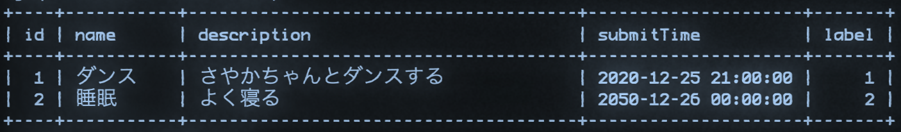
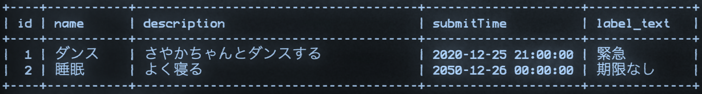
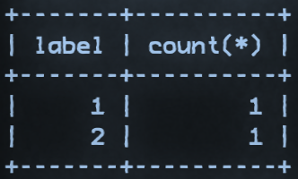
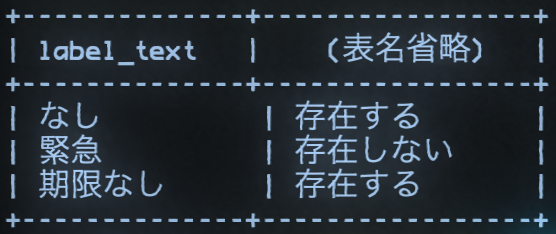

# たのしい宿題 バックエンド編

### 宿題．好きでしょ？やろうや．

問に合わせてサンプルを改造してください．

## 第一問

かけるくんは，さやかちゃんのことが好きです．現在，Todo リストのラベルには「なし」,「緊急」,「期限なし」の 3 つがありますが，もう一つ「さやか ♡」というラベルを選択できるようにしたいです．

さて，かけるくんは/labels の処理を改造し，/labels の POST を送信すると，新しいラベルが登録できるようにしようと考えました．

```
{"id": (Number), "labelText": (string)}
```

という形式で，body を使用して新しいラベルが送信されると想定して，apifuncs/labels.go の LabelsFunc を改造し，上記のリクエストを受け付けられるようにしなさい．ただし，データベースの操作も伴うので，dbctl/labels.go に新しく関数を追加しなければなりません．

送信される JSON の例

```
{"id": 3, "labelText": "さやか♡"}
```

curl の例

```
curl -H "content-type: application/json" -X POST -d '{"id": 3, "labelText": "さやか♡"}' http://localhost:8081/labels
```

## 第二問

フロントエンドエンジニアのけんしんくんから，以下のような依頼がありました．:

```
悪いんやけど、/tasks/labelTextにアクセスしたら、labelがIDじゃなくて文字列になってるタスク一覧が受け取れるようにして欲しいんや！よろしくな！
```

つまるところ，



これを



こうして欲しいらしいです．

/tasks/labelText に GET のリクエストを送信すると，Tasks の label が文字列になったタスク一覧を受け取れるようにしてください．

ただし，リクエストに body やクエリパラメータには何も添付しないものとします．

また，以下のような形式で返すようにしてください．

```
[{"id":1, "name":"ダンス", "description":"さやかちゃんとダンスする", "submitTime":"2050/12/25 21:00:00", "labelText": "緊急"},{"id":2, "name":"ダンス2", "description":"かけるくんとダンスする", "submitTime":"2050/12/25 21:00:03", "labelText": "期限なし"}]
```

## 第三問

けんしんくんロボから，以下のような依頼がありました．:

```
11100110 10000010 10101010 11100011 10000001 10000100 11100011 10000010 10010011 11100011 10000010 10000100 11100011 10000001 10010001 11100011 10000001 10101001 11100011 10000000 10000001 00101111 01100011 01101111 01110101 01101110 01110100 11100011 10000001 10101011 11100011 10000010 10100010 11100011 10000010 10101111 11100011 10000010 10111011 11100011 10000010 10111001 11100011 10000001 10010111 11100011 10000001 10011111 11100011 10000010 10001001 11100011 10000011 10101001 11100011 10000011 10011001 11100011 10000011 10101011 11100011 10000001 10010011 11100011 10000001 10101000 11100011 10000001 10101011 11100011 10000010 10111111 11100011 10000010 10111001 11100011 10000010 10101111 11100011 10000001 10101110 11100110 10010101 10110000 11100011 10000010 10010010 11100110 10010101 10110000 11100011 10000001 10001000 11100011 10000001 10100110 11100011 10000001 10001111 11100011 10000010 10001100 11100011 10000010 10001011 11100011 10000010 10001000 11100011 10000001 10000110 11100011 10000001 10101011 11100011 10000001 10010111 11100011 10000001 10100110 11100110 10101100 10110010 11100011 10000001 10010111 11100011 10000001 10000100 11100011 10000010 10010011 11100011 10000010 10000100 11101111 10111100 10000001 11100011 10000010 10001000 11100011 10000010 10001101 11100011 10000001 10010111 11100011 10000001 10001111 11100011 10000001 10101010 11101111 10111100 10000001
```

つまるところ，/count に GET リクエストを送信すると，


これを



SQL でこのようにする．（つまり，ラベルごとにタスクの数を数える．）

そうしてこれを，

```
[{label: 1, count: 1,}, {label: 2, count: 1}]
```

このような形の配列にして，クライアントに送信して欲しいとのことです．

以上のことを踏まえ，/count に対する処理を実装してください．

ただし，リクエストに body やクエリパラメータには何も添付しないものとします．

## 第四問（それなりに難問）

惑星ケンシンから，以下のような電気信号を受信しました．:

```
うてやせみあに！
チセケ一覧ぬ存在すとうれきすとうにうきん教おとけろれリベレ一覧ん出すとけろれTRMが欲すうあゆ！
らわすけに！
```

つまり，



このような表示を行ってくれる SQL が欲しいとのことです．（つまり，全てのラベルについて tasks にて使用されているか判定する SQL．）

このような SQL を作成し，実行し，動作を確認しなさい．（ユーザから URL を通して使用できるようにする必要はありません．）
